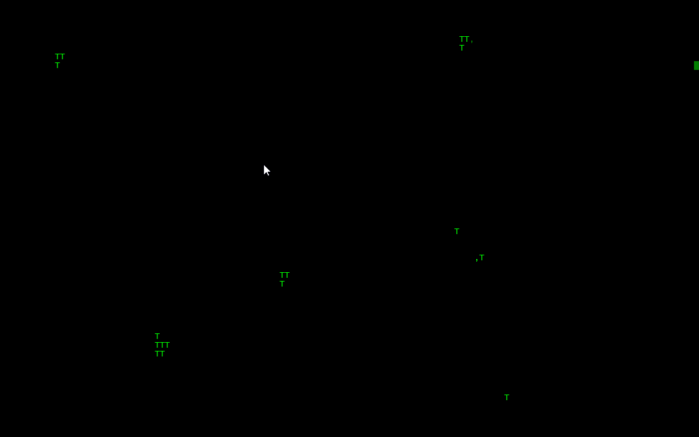
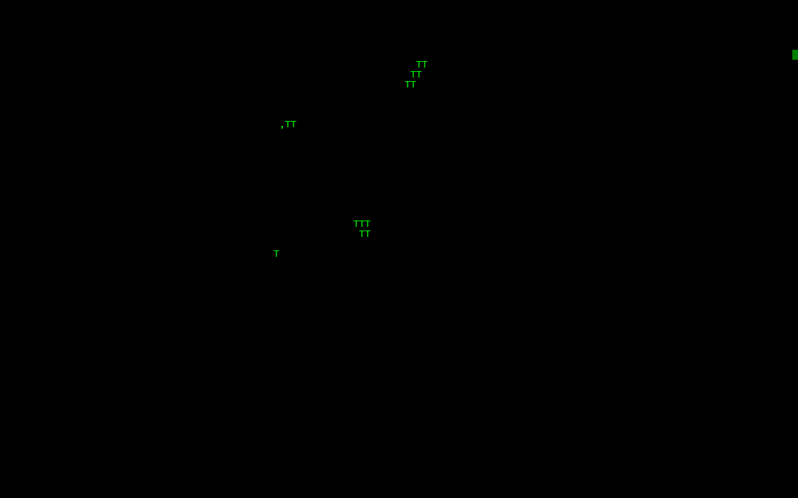

# Forest-Fires

A simple and rough simulation of forest fires on the windows console. It's mainly meant as a demonstration of rendering and animating ASCII-art on the console, as well as responding the keyboard and mouse events. It would also probably make for a cool screen-saver.

This simulation is based on the [forest-fire model](https://en.wikipedia.org/wiki/Forest-fire_model) cellular automata - although I've tweaked the rules a bit to make it look more interesting.

This is a console-application, although it responds to mouse and keyboard input, and it's animated without any flickering as you can see in the examples.

## Requirements

The program uses the Windows API to manipulate the console - so this will definitely only work on Windows. It _should_ work on Windows 2000+ however I could only test it on Windows 7 and 10. If you want to compile it yourself, you'll need a C99 compiler. If you just want to try the program I provided [an executable](./Forest%20Fires.exe). 

## Controls

Trees have a random chance of growing on empty cells, and have a chance to spread to neighboring cells each turn. Every tree could randomly catch fire any turn, and the fire will quickly spread to all neighboring trees. 

key                   | action
:--------------------:|:------:
<kbd>Left-click</kbd> | place trees
<kbd>Right-click</kbd>| start fires
<kbd>C</kbd>          | clear everything
<kbd>ESC</kbd>        | quit

## Licence

This is provided under the public domain - you can do whatever you want with the program and the source code :)
